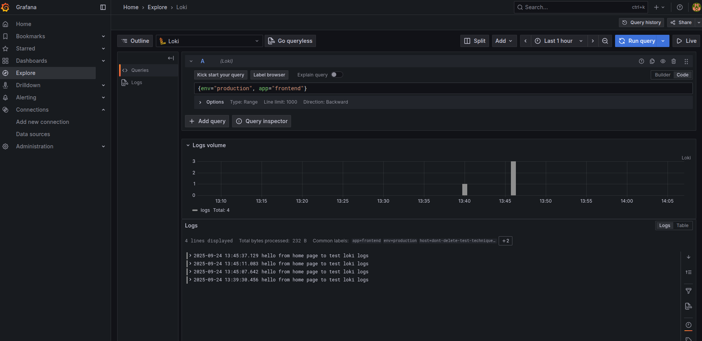

# Monitoring Stack Setup Documentation

## Overview

This document provides a complete overview of the monitoring stack deployed using Ansible. The stack consists of **Grafana** and **Loki** running as Docker containers on the target host.

---

## Ansible Role Structure

```text
monitoring/
├── defaults
│   └── main.yml       # Default variables
├── files
│   └── etc
│       ├── grafana
│       │   ├── grafana.ini.j2
│       │   └── provisioning/datasources/loki.yml.j2
│       └── loki
│           └── loki.yml.j2
├── handlers
│   └── main.yml       # Restart Loki handler
├── tasks
│   ├── install_grafana.yml
│   ├── install_loki.yml
│   └── main.yml       # Main tasks
└── templates
```

---

## Variable Configuration

`defaults/main.yml` contains variables for both Grafana and Loki:
---

## Loki Setup

### Directories

* Config: `/etc/loki`
* Data: `/var/lib/loki`

### Docker Container

* Image: `grafana/loki:3.3.0`
* Network: `monitoring_net`
* Ports: `127.0.0.1:4100:4100`
* Config mounted: `/etc/loki/loki.yml`
* Data mounted: `/var/lib/loki`

---

## Grafana Setup

### Directories

* Config: `/etc/grafana`
* Provisioning folder: `/etc/grafana/provisioning/datasources`

### Docker Container

* Image: `grafana/grafana`
* Network: `monitoring_net`
* Ports: `127.0.0.1:4000:4000`
* Config mounted: `/etc/grafana/grafana.ini`
* Datasource: Loki

---

## Ansible Deployment

### Inventory Example

```yaml
all:
  hosts:
    monitoring:
      ansible_host: <VPS_HOST>
```

### Deployment Command

```bash
ansible-playbook -i inventory/hosts.yml deploy-app.yml --tags deploy-monitoring
```

### GitHub Actions Workflow to automatically deploy monitoring

* Uses Docker container with Ansible
* Mounts workspace and SSH keys
* Runs `ansible-playbook` inside the container
* Can be triggered manually via the github actions UI

---

## Screenshot


```

```

---

## References

* [Grafana Documentation](https://grafana.com/docs/)
* [Loki Documentation](https://grafana.com/docs/loki/latest/)
