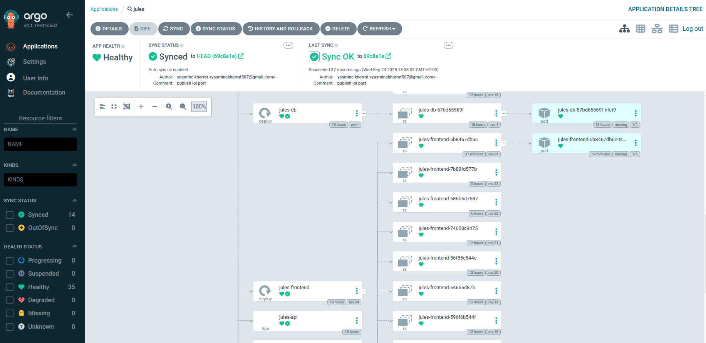
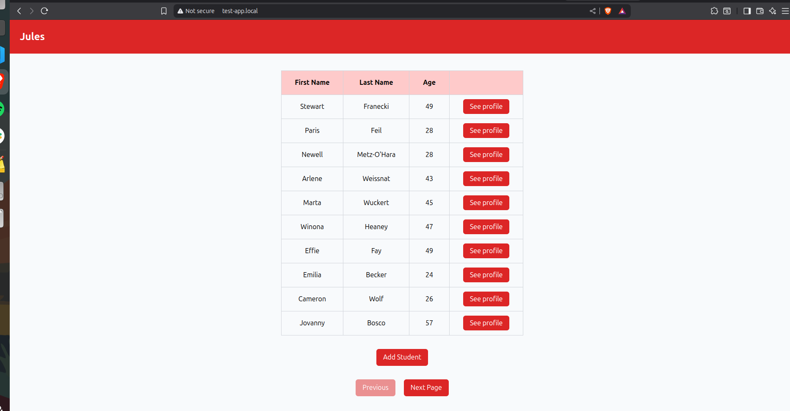

# Jules Helm Charts on minikube and Argo CD Setup Documentation

This document provides comprehensive documentation for the `Jules` Helm chart project, including its structure, templates, values, and Argo CD integration.

---

## Project Structure

```
helm/jules/
├── Chart.yaml
├── charts/
│   ├── api/
│   │   ├── Chart.yaml
│   │   ├── templates/
│   │   │   ├── deployment.yaml
│   │   │   ├── hpa.yaml
│   │   │   ├── ingress.yaml
│   │   │   ├── secret.yaml
│   │   │   ├── service.yaml
│   │   │   └── _helpers.tpl
│   │   └── values.yaml
│   ├── frontend/
│   │   ├── Chart.yaml
│   │   ├── templates/
│   │   │   ├── configmap.yaml
│   │   │   ├── deployment.yaml
│   │   │   ├── hpa.yaml
│   │   │   ├── ingress.yaml
│   │   │   ├── service.yaml
│   │   │   └── _helpers.tpl
│   │   └── values.yaml
│   └── db/
│       ├── Chart.yaml
│       ├── templates/
│       │   ├── deployment.yaml
│       │   ├── pvc.yaml
│       │   ├── secret.yaml
│       │   ├── service.yaml
│       │   └── _helpers.tpl
│       └── values.yaml
└── values-secret.yaml
```

---

## Root Chart: `jules`

**Chart.yaml**

* Umbrella chart combining `api`, `frontend`, and `db` subcharts.
* Version: 0.1.0, AppVersion: 1.0.0.

**Dependencies**

* `api`: `file://../api`
* `frontend`: `file://../frontend`
* `db`: `file://../db`

**values-secret.yaml**

* Stores sensitive values for database and API connections.
* Uses environment variables to populate secrets and API configuration.

---

## Subchart: API

**Chart.yaml**

* Name: `api`
* Version: 0.1.0, AppVersion: 1.0.0

**Templates:**

* `deployment.yaml`: API deployment with image, env vars, and init container for migrations.
* `service.yaml`: ClusterIP service exposing API on port defined in values.
* `ingress.yaml`: Configures host `api.local` with NGINX rewrite.
* `hpa.yaml`: HorizontalPodAutoscaler using CPU metrics from Metrics Server.
* `secret.yaml`: Holds `DB__DB_URI` as secret.
* `_helpers.tpl`: Defines reusable template functions (name, fullname, labels, env).

**Values.yaml:**

* Image repository: `ghcr.io/yasminekharrat123/jules-backend`
* Replica count: 1
* Service type: ClusterIP, port 3001
* Env vars: API\_PORT, pagination, CORS allowed hosts, seed count
* Secrets: DB connection string
* Resources: CPU and memory limits/requests
* HPA enabled with min/max replicas 1/3 and target CPU 70%
* ImagePullSecrets: `ghcr-secret`

---

## Subchart: Frontend

**Chart.yaml**

* Name: `frontend`, version: 0.1.0, appVersion: 1.0.0

**Templates:**

* `deployment.yaml`: Deployment for frontend container, uses envFrom ConfigMap.
* `service.yaml`: ClusterIP service
* `configmap.yaml`: Holds frontend environment variables
* `ingress.yaml`: Host-based routing, NGINX annotations
* `hpa.yaml`: HorizontalPodAutoscaler
* `_helpers.tpl`: Template helpers for name, fullname, env variables

**Values.yaml:**

* Image repo: `ghcr.io/yasminekharrat123/jules-modified-frontend`
* Replica count: 1
* Service: ClusterIP, port/targetPort 3000
* Ingress: Enabled, host `test-app.local`, class nginx, annotations for rewrite-target
* Resources: CPU and memory limits/requests
* Env: `NEXT_PUBLIC_API_URL` from environment
* HPA: enabled, min 1, max 3, target CPU 70%
* ImagePullSecrets: `ghcr-secret`

---

## Subchart: Database (DB)

**Chart.yaml**

* Name: `db`, version: 0.1.0, appVersion: 1.0.0

**Templates:**

* `deployment.yaml`: Postgres deployment with env from secret and volumeMount for PVC.
* `pvc.yaml`: PersistentVolumeClaim for database storage
* `service.yaml`: ClusterIP service exposing Postgres
* `secret.yaml`: Holds `POSTGRES_DB`, `POSTGRES_USER`, `POSTGRES_PASSWORD`
* `_helpers.tpl`: Template helpers

**Values.yaml:**

* Image: Postgres 16-alpine
* Service: ClusterIP, port 5432
* Persistence: 1Gi storage
* Secrets empty by default, populated via `values-secret.yaml`
* Replica count: 1

---

## Minikube Setup

### 1. Secrets

* GitHub Container Registry secret created manually:

```bash
kubectl create secret docker-registry ghcr-secret --docker-server=ghcr.io --docker-username=<username> --docker-password=<token>
```

### 2. Ingress

* Enabled Minikube ingress plugin:

```bash
minikube addons enable ingress
```

* Added Minikube IP to `/etc/hosts` for fake DNS:

```
<minikube-ip> api.local test-app.local
```

### 3. Metrics Server

* Enabled for HPA metrics:

```bash
minikube addons enable metrics-server
```

* HPA relies on real-time CPU/memory metrics from Metrics Server.


### 4. Using Environment Variables with Helm Deployment

You can use environment variables with a `values-secret.yaml` file for deploying the Jules application using Helm.

#### 1. Create `values-secret.yaml`

Create a file named `values-secret.yaml` with the following content:

```yaml
db:
  secrets:
    POSTGRES_DB: "${POSTGRES_DB}"
    POSTGRES_USER: "${POSTGRES_USER}"
    POSTGRES_PASSWORD: "${POSTGRES_PASSWORD}"

api:
  secrets:
      DB__DB_URI: "${DB__DB_URI}"
  env:
    API__API_PORT: "${API__PORT}"
    API__PAGINATION__PAGE_SIZE: "${API_PAGINATION_PAGE_SIZE}"
    API__CORS__ALLOWED_HOST_JSON: '${API_CORS_JSON}'
    SEED__USERS__COUNT: "${SEED_USERS_COUNT}"

frontend:
  env:
    NEXT_PUBLIC_API_URL: "${NEXT_PUBLIC_API_URL}"
```

#### 2. Export Environment Variables

Before deploying, export the necessary environment variables:

```bash
export POSTGRES_DB=your_db_name
export POSTGRES_USER=your_db_user
export POSTGRES_PASSWORD=your_db_password
export DB__DB_URI=your_db_uri
export API__PORT=3001
export API__PAGINATION__PAGE_SIZE=20
export API_CORS_JSON='[]'
export SEED_USERS_COUNT=50
export NEXT_PUBLIC_API_URL=http://host:3001
```

#### 3. Deploy Helm Chart Using `envsubst`

Use `envsubst` to substitute the variables in `values-secret.yaml` and deploy the Helm chart:

```bash
envsubst < helm/jules/values-secret.yaml | helm upgrade --install jules ./helm/jules -n jules -f -
```
* The `-f -` flag tells Helm to read values from stdin after `envsubst` substitution.
* Make sure all required environment variables are exported before running the command.


### 5. Argo CD Integration ( alternative)

* Application created:

```bash
argocd app create jules \
  --repo https://github.com/yasminekharrat123/jules.git \
  --path helm/jules \
  --dest-server https://kubernetes.default.svc \
  --dest-namespace jules \
  --helm-set db.secrets.POSTGRES_DB="$POSTGRES_DB" \
  --helm-set db.secrets.POSTGRES_USER="$POSTGRES_USER" \
  --helm-set db.secrets.POSTGRES_PASSWORD="$POSTGRES_PASSWORD" \
  --helm-set api.secrets.DB__DB_URI="$DB__DB_URI" \
  --helm-set api.env.API__PORT="$API__PORT" \
  --helm-set api.env.API__API_PORT="$API__PORT" \
  --helm-set api.env.API__PAGINATION__PAGE_SIZE="$API_PAGINATION_PAGE_SIZE" \
  --helm-set-string api.env.API__CORS__ALLOWED_HOST_JSON="$API_CORS_JSON" \
  --helm-set api.env.SEED__USERS__COUNT="$SEED_USERS_COUNT" \
  --helm-set-string frontend.env.NEXT_PUBLIC_API_URL="$NEXT_PUBLIC_API_URL"
```

* Sync policy automated with pruning and self-heal:

```bash
argocd app set jules --sync-policy automated --auto-prune --self-heal
```

* Verify Argo CD application status:

```bash
argocd app get jules
```

```

```

```

```

---

## Notes

* All deployments, services, secrets, ingresses, HPA, and ConfigMaps are templated for Helm.
* Secrets are managed using Helm templating with `values-secret.yaml` for environment integration.
* The frontend and API services are exposed through Minikube ingress.
* HPA scales deployments automatically based on CPU utilization.
* Minikube metrics-server must be enabled for HPA to function.
* Ingress resources are set up with custom hosts for local development (test-app.local and api.local).

